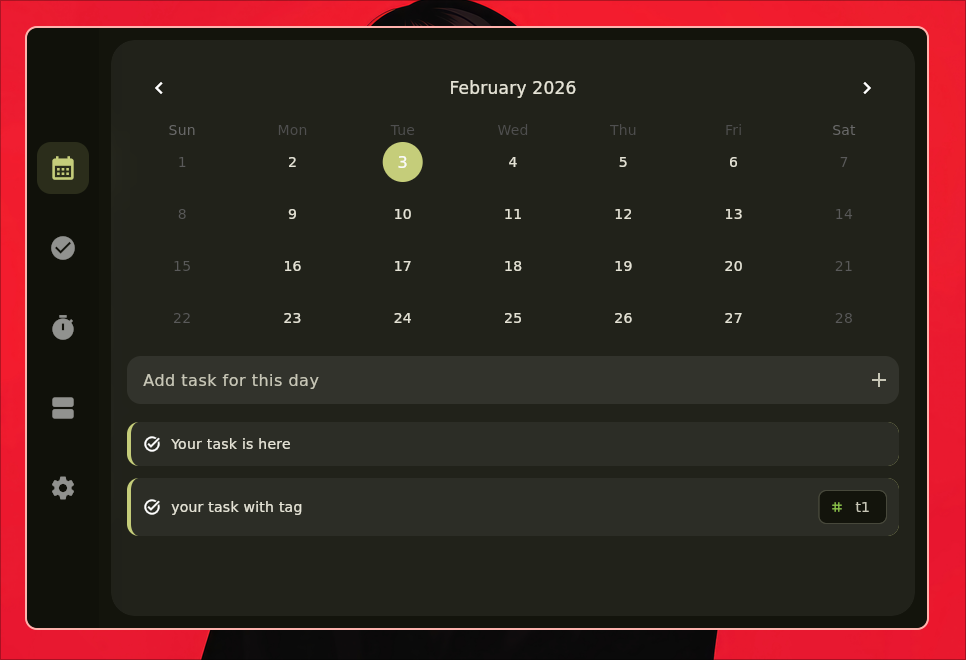
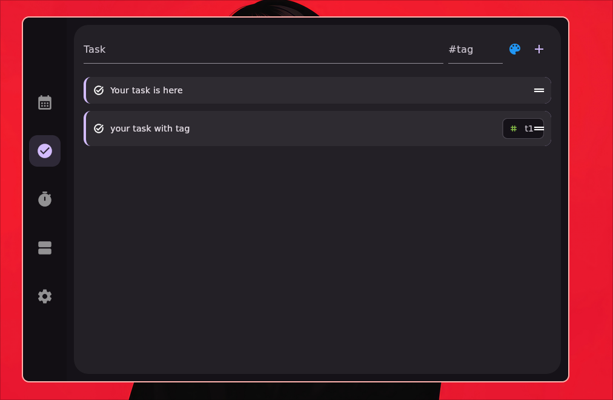
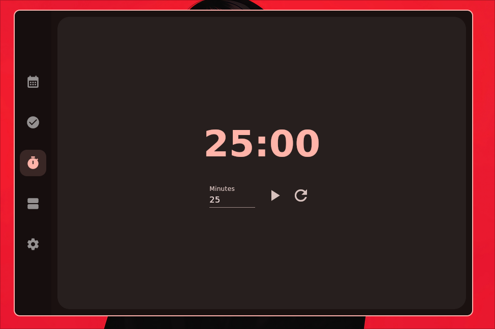
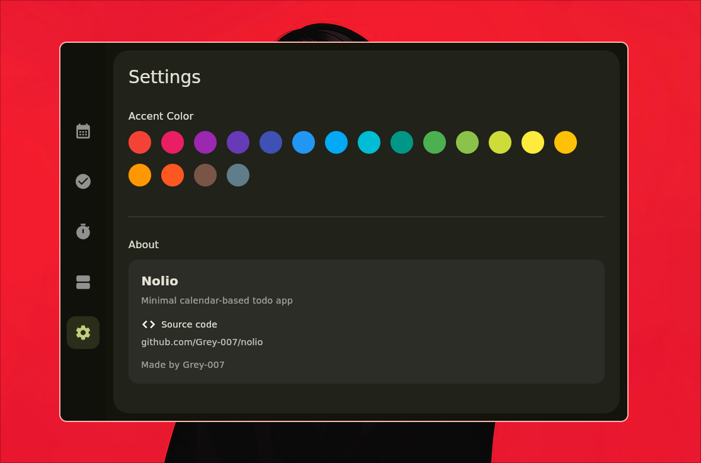

# Nolio

**Nolio** is a minimal, calendar-based todo app focused on clarity, smooth interactions, and distraction-free task planning.

Built with **Flutter** and designed primarily for **Linux desktop**, Nolio lets you plan tasks day-by-day with a clean, modern UI that stays out of your way.

---

## ✨ Features

- 📅 Calendar-based task planning  
- ✅ Date-specific todos  
- 🏷️ Tags with color support  
- ⏱️ Built-in timer  
- 🎨 Accent color customization  
- 🐧 Native Linux desktop application  
- ⌨️ Keyboard-friendly workflow  

---

## 📦 Installation

### Arch Linux (AUR)

```bash
yay -S nolio
```
---

## 🖥️ Screenshots

| Calendar | Todos |
|---------|-------|
|  |  |

| Timer | Settings |screenshot
|-------|----------|
|  |  |

---

## 🛠️ Development

### Requirements

* Flutter (Linux desktop enabled)
* Dart SDK

### Run locally

```bash
flutter pub get
flutter run -d linux
```

---

## 🧭 Roadmap

* 📊 Overview / timeline view (all tasks sorted by date)
* 📱 Android support
* 🪟 Windows support
* 🔔 Notifications
* ☁️ Optional sync

---

## 🤝 Contributing

Contributions, ideas, and feedback are welcome.

Feel free to:

* Open issues for bugs or feature requests
* Submit pull requests for improvements

---

## 📄 License

This project is licensed under the **MIT License**.
See the [LICENSE](LICENSE) file for details.

---

## 👤 Author

Made by **Grey-007**

GitHub: [https://github.com/Grey-007](https://github.com/Grey-007)

````

---